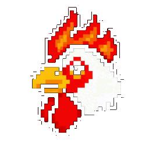

<div align="center">
  <br/><br/>

  <h1>Roasi</h1>
  <p><strong>Your website is getting roasted tonight.</strong></p>
  <p>An AI agent that audits your site with the energy of a Filipino senior dev — four beers deep, completely out of patience, and brutally correct.</p>

  <br/>

  <!-- Stack badges -->
  
  
  
  
  
  
  
  

</div>

---

## Meet Roasi

Roasi is the AI agent at the heart of this product. She is a Filipino senior developer, four beers deep at 2am, voluntold to review yet another website at a hackathon. Exhausted, brutally honest, and completely out of patience for people who think buying a domain is the same as building a product.

**Her voice never changes.** Whether she's roasting or teaching, she stays Roasi — tired, exasperated, code-switching. She explains LCP like she cannot believe she has to. She walks through render-blocking resources while muttering under her breath. The teaching is real. The warmth is not.

**Every line she writes is data-driven.** Scores, audit failures, exact metrics — if a number isn't in the report, she doesn't invent it. Vague roasts are for people who are also bad at their jobs.

**Her code-switching is structural.** Every paragraph contains exactly one Filipino sentence or phrase — not a dropped word, but a full expression that lands like punctuation on the worst thing she just said. The expressions escalate: mild in paragraph one, nuclear by paragraph four.

**The roast is four paragraphs, no headers:**
1. React to what the site is trying to be — start mid-thought
2. Specifics — exact audit failures, exact scores, exact metrics
3. Pull back — who built this and what do they think they built
4. Find the one thing that almost worked, name it sincerely, then dismantle it

> Roasi does not modify code, write files, or touch the user's codebase. She scans, analyzes, teaches, and guides.

---

## How It Works

```
User submits a URL
       │
       ▼
  ┌─────────────────────────────────────────────┐
  │              Roasi Agent Loop               │
  │                                             │
  │  1. Scan    →  Unlighthouse audit           │
  │  2. Analyze →  Priority-tier categorization │
  │  3. Roast   →  Brutal, structured critique  │
  │  4. Guide   →  Actionable recommendations   │
  └─────────────────────────────────────────────┘
       │
       ▼
  Results stream in real time via SSE
```

---

## Tech Stack

### Monorepo

<div align="center">

| | Tool | Purpose |
|---|------|---------|
|  | **Turborepo** | Task orchestration, build caching |
|  | **pnpm workspaces** | Package management |
|  | **Biome** | Formatting + linting |
|  | **TypeScript** | Shared configs via `packages/typescript-config` |

</div>

### Frontend

<div align="center">

| | Library | Version | Role |
|---|---------|---------|------|
|  | **Next.js** (App Router) | 16.1.6 | Web framework with Turbopack |
|  | **React** | 19.2 | UI runtime |
|  | **Tailwind CSS** | 4.1 | Styling |
|  | **shadcn/ui** | base-lyra | Component primitives |
|  | **Pixi.js** | 8.13 | 2D sprite animations (Roasi mascot) |
|  | **Motion** | 12.38 | UI animations |

</div>

### AI / Agent

<div align="center">

| | Library | Role |
|---|---------|------|
|  | **Vercel AI SDK** (`ai` 6.x) | Agent loop, streaming, tool use |
|  | **@ai-sdk/mistral** | LLM provider (`mistral-small-latest`) |
|  | **Unlighthouse** | Headless Lighthouse auditing engine |
|  | **Puppeteer** | Browser automation for scans |
|  | **Zod** | Tool input schema validation |

</div>

### Infrastructure

<div align="center">

| | Service | Role |
|---|---------|------|
|  | **Vercel** | Hosting + serverless functions |
|  | **Supabase** | Optional persistent storage |
|  | **Cloudflare Turnstile** | Bot protection |
|  | **Firecrawl** | Web scraping for scan tools |

</div>

---

## Architecture

### Monorepo Structure

```
/
├── apps/
│   ├── web/               # Next.js 16 main application
│   └── design-system/     # Vite-based component explorer
├── packages/
│   ├── ai/                # LLM agent, tools, prompts
│   ├── ui/                # Shared React components (shadcn/ui)
│   ├── sprite-animations/ # Pixi.js Roasi mascot animations
│   ├── eslint-config/     # Shared ESLint rules
│   └── typescript-config/ # Shared tsconfig presets
```

### Agent Tool Loop

```
POST /api/roast
  └─ ToolLoopAgent (Vercel AI SDK)
      ├─ planTool / updateStep    — declare & track workflow steps
      ├─ scanSite                 — Unlighthouse audit (4 modes)
      ├─ analyzeScanReport        — priority-tier categorization
      ├─ memoryTool               — persistent core/notes/conversation storage
      └─ loadSkill / bash         — dynamic skill execution
```

### Roasi's Prompts

Roasi's behavior is defined in prompt files under `packages/ai/src/agents/roasi/prompts/`:

| File | Purpose |
|------|---------|
| `PERSONALITY.md` | Voice, tone, code-switching rules, roast structure, profanity guidelines |
| `AGENT.md` | Workflow, tools, audience calibration, output format, content guard |
| `ROAST.md` | Extended roast delivery examples |

### Streaming

Responses stream via SSE (Server-Sent Events). The client uses the Vercel AI SDK `useChat` hook, and tool results render with custom per-type components as they arrive — no batching.

### Filesystem Storage

No database. All state lives on the filesystem under `.workspace/`:

```
.workspace/
├── .memory/
│   ├── core.md                     # Facts injected into every agent turn
│   ├── notes.md                    # Archival notes
│   └── conversations/
│       ├── {chatId}.jsonl          # Message history (JSONL per chat)
│       └── titles/{chatId}.txt     # Chat titles for sidebar
└── .reports/{timestamp}/           # Lighthouse HTML reports (served via /api/reports)
```

### Scan Modes

| Mode | Pages | Description |
|------|-------|-------------|
| `default` | 1 | Homepage only |
| `targeted` | Custom | Specific paths |
| `smart` | ~20 | Sitemap-guided |
| `full` | 200 | Full crawl |

> SSRF protection blocks all private/local hosts and cloud metadata endpoints.

### Priority Tiers

| Tier | Audits |
|------|--------|
| 🔴 **1 — Critical** | is-crawlable, meta-description, LCP, CLS, TTI |
| 🟠 **2 — High impact** | color-contrast, image-alt, WebP images, render-blocking, unused JS/CSS |
| 🟡 **3 — Enhancements** | Everything else |

---

## Getting Started

### Prerequisites

- Node.js >= 20
- pnpm 9.x

### Setup

```bash
pnpm install
```

Create `apps/web/.env.local`:

```env
# App
NEXT_PUBLIC_APP_URL=http://localhost:3000

# AI
MISTRAL_API_KEY=your_key_here

# Web scraping (used by scan tools)
FIRECRAWL_API_KEY=your_key_here

# Bot protection (Cloudflare Turnstile) — optional
# When omitted, Turnstile verification is skipped entirely
NEXT_PUBLIC_TURNSTILE_SITE_KEY=your_site_key_here
TURNSTILE_SECRET_KEY=your_secret_key_here

# Supabase (optional — for persistent storage)
SUPABASE_URL=your_supabase_url
SUPABASE_SERVICE_ROLE_KEY=your_service_role_key

# Feature flags
CHAT_ENABLED=true
```

### Dev

```bash
pnpm dev
```

Opens at `http://localhost:3000`.

### Build

```bash
pnpm build
```

---

## UI Components

shadcn components are added to `packages/ui`:

```bash
pnpm dlx shadcn@latest add button -c apps/web
```

Import from the shared package:

```tsx
import { Button } from "@roaster/ui/components/button";
```
